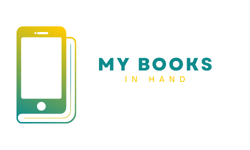

# MyBooks - Sua biblioteca de histórias

## Tecnologias Utilizadas 💻

O aplicativo MyBooks foi desenvolvido utilizando as seguintes tecnologias:

- **Linguagem de Programação**: TypeScript / JavaScript
- **Framework de Desenvolvimento**: React Native / Expo
- **Banco de Dados**: Firebase Cloud Storage
- **Autenticação de Usuário**: Firebase Authentication
- **Armazenamento em Nuvem**: Firebase Cloud Storage

## Informações do Projeto 📝

O MyBooks é um aplicativo mobile para gerenciar seus livros favoritos. Explore, organize e mergulhe em mundos literários com o MyBooks. Gerencie seus livros lidos com facilidade e redescubra o prazer da leitura. 

## Sobre

Este é um projeto prático desenvolvido no curso de formação inicial e continuada da plataforma **[+IFMG](https://mais.ifmg.edu.br/maisifmg/course/view.php?id=138)** (Instituto Federal de Minas Gerais) - **Programação para dispositivos móveis - Avançado**

### Principais recursos do MyBooks 📚:

- **Biblioteca Pessoal**: Os usuários podem criar uma biblioteca pessoal com os livros que estão lendo atualmente e já leram.

<!-- - **Exploração de Livros**: O aplicativo permite aos usuários explorar uma vasta coleção de livros, pesquisar por gênero, autor ou título e obter informações detalhadas sobre cada livro.

- **Leitura Offline**: Os livros podem ser baixados para leitura offline, garantindo que os usuários possam desfrutar de seus livros favoritos em qualquer lugar, a qualquer momento.

- **Sincronização com Conta Google**: Os usuários podem fazer login com sua conta do Google para sincronizar sua biblioteca em diferentes dispositivos e manter seu progresso de leitura atualizado. -->

## Melhorias Futuras

Estamos sempre trabalhando para melhorar o MyBooks e oferecer uma experiência ainda melhor aos nossos usuários. Algumas das melhorias planejadas para futuras versões incluem:

1. **Avaliações**: Adicionar notas e avaliações aos livros.

2. **Compartilhamento Social**: Os usuários poderão compartilhar recomendações de livros com amigos.

<!-- 1. **Suporte a Áudio Livros**: Adicionar a opção de ouvir livros em formato de áudio, tornando o aplicativo mais acessível.

2. **Recomendações Personalizadas**: Implementar um sistema de recomendações baseado no histórico de leitura dos usuários.

3. **Suporte a Múltiplos Idiomas**: Expandir a oferta de livros em diferentes idiomas para atender a uma audiência global.

4. **Integração com Redes Sociais**: Permitir que os usuários compartilhem trechos de livros nas redes sociais.

5. **Leitura em Grupo**: Adicionar a funcionalidade de leitura em grupo, onde os usuários podem participar de clubes de leitura virtuais. -->

Fique atento às atualizações do MyBooks e continue desfrutando da sua paixão pela leitura conosco!

